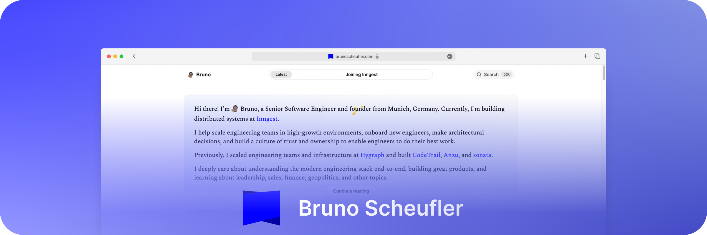

👋 Welcome to my profile! I'm [Bruno](https://brunoscheufler.com), a Senior Software Engineer and founder from Munich, Germany.

I help scale engineering teams in high-growth environments, onboard new engineers, make architectural decisions, and build a culture of trust and ownership to enable engineers to do their best work. Previously, I scaled engineering teams and infrastructure at Hygraph and built CodeTrail, Anzu, and sonata.

- 🆕 I'm currently working as a Senior Distributed Systems Engineer at [Inngest](https://www.inngest.com), which makes it easy for teams to reduce complexity and save time building durable functions and background jobs
- 📝 I regularly [write posts](https://brunoscheufler.com/) on software engineering, my experience building digital software products, and other areas I care about
- 🍻 I studied Computer Science and Management at the Technical University of Munich

If you want to get in touch, feel free to reach out on X or drop a mail 👍
