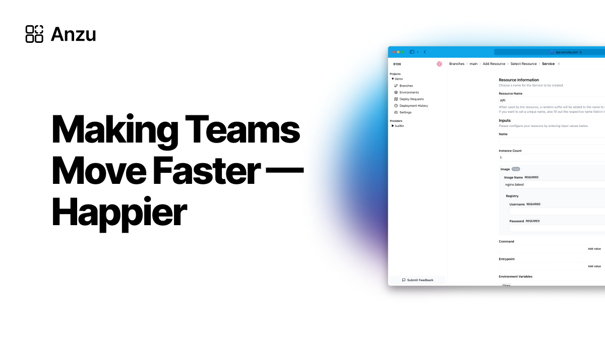

👋 Welcome to my profile! I'm [Bruno](https://brunoscheufler.com/), you might know me from my [posts](https://brunoscheufler.com/) focused on software engineering, with technologies including GraphQL, Go, Node.js, SwiftUI, and other things I have picked up over the years.

- 🆕 I'm currently working hard on building [Anzu](https://anzuhq.com), a platform for teams to manage their cloud resources, share knowledge, and build their products faster, happier.
- 📝 I regularly [write posts](https://brunoscheufler.com/) on software engineering, my experience building digital software products, and other areas I care about
- 🌍 I'm building the GraphQL-native, headless-first CMS of the future with the amazing folks at [GraphCMS](https://graphcms.com)
- 🍻 I'm studying Management and Technology at the Technical University of Munich

If you want to get in touch, feel free to reach out on Twitter or drop a mail 👍
